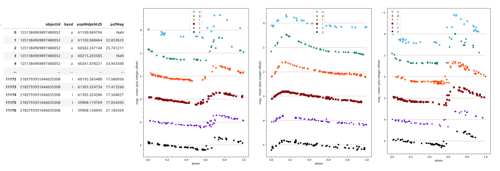
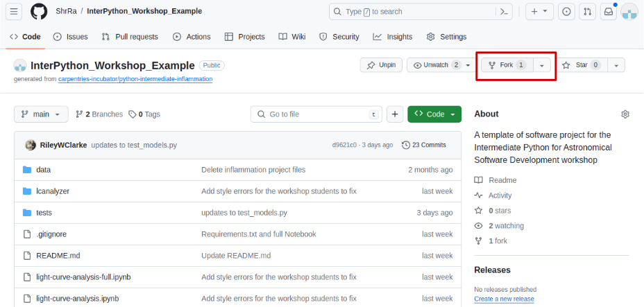
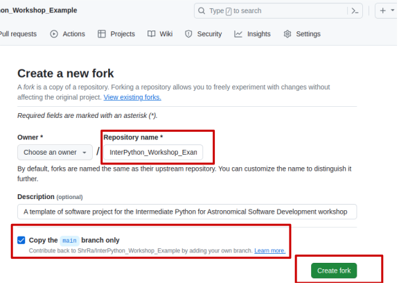
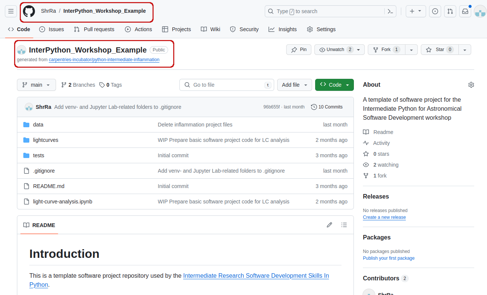
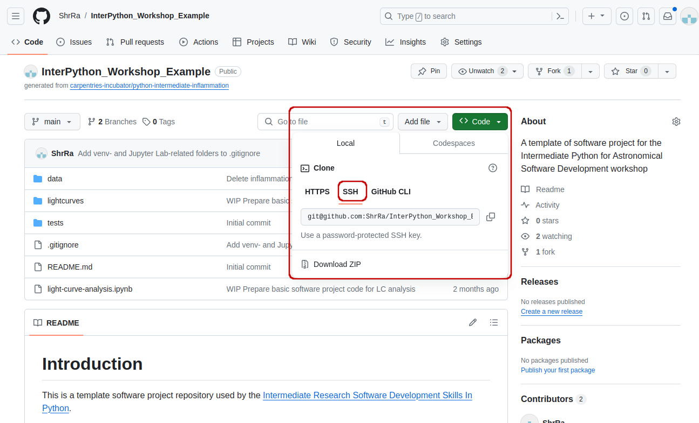

## Light Curve Analysis Project
For this workshop, let's assume that you  have joined a software development team that has been working on the
[light curve analysis project](https://github.com/ShrRa/InterPython_Workshop_Example)
developed in Python and stored on GitHub. The purpose of this software is to analyze the variability of astronomical sources, 
using observations that come from different instruments. 

{: .image-with-shadow width="800px" }

> ## What Does Light Curve Dataset Contain?
>
> For developing and testing our software project, we will use two RR Lyrae candidates variability datasets.
>
> The first dataset, `kepler_RRLyr.csv`, contains observations coming from the Kepler space telescope.
> In this dataset, all observations are related to the same source,
> i.e. the whole table represents a single light curve. The second dataset, `lsst_RRLyr.pkl`, contains synthetic
> observations of 25 presumably variable sources from the LSST Data Preview 0. Considering that the datasets
> come from different instruments, they also have different formats and column names - a common
> situation in real life. It is always a good idea to develop your
> software in such a way that it remains usable even if the format of the input data has changed. We will use the differences
> of the datasets to illustrate some of the topics during this workshop.
{: .callout}

The project is not finished and contains some errors.
You will be working on your own and in collaboration with others
to fix and build on top of the existing code during the course.

## Downloading Our Software Project

To start working on the project, you will first
create a copy of the software project template repository
from GitHub within your own GitHub account
and then obtain a local copy of that project (from your GitHub) on your machine.

1. Make sure you have a GitHub account
   and that you have set up your SSH key pair for authentication with GitHub,
   as explained in [Setup](../setup.html#secure-access-to-github-using-git-from-command-line).
2. Log into your GitHub account.
3. Go to the [software project repository](https://github.com/ShrRa/InterPython_Workshop_Example)
   in GitHub.

   {: .image-with-shadow width="800px" }

4. Click the `Fork` button towards the top right of the repository’s GitHub page to
   create a fork of the repository under your GitHub account.
   Remember, you will need to be signed into GitHub for the `Fork` button to work.

   _Note: each participant is creating their own fork of the project to work on._
5. Make sure to select your personal account
   and set the name of the project to `InterPython_Workshop_Example`
   (you can call it anything you like,
   but it may be easier for future group exercises if everyone uses the same name).
   Also set the new repository's visibility to 'Public' -
   so it can be seen by others and by third-party Continuous Integration (CI) services
   (to be covered later on in the course) and select the `Copy the main branch only` checkbox.

   {: .image-with-shadow width="600px" }

6. Click the `Create fork` button
   and wait for GitHub to import the copy of the repository under your account.
7. Locate the forked repository under your own GitHub account. GitHub should redirect you there
   automatically after creating the fork. If this does not happen, click your user icon in the top
   right corner and select Your Repositories from the drop-down menu, then locate your newly created fork.

   {: .image-with-shadow width="800px" }

> ## Exercise: Obtain the Software Project Locally
> Using the command line, clone the copied repository
> from your GitHub account into the home directory on your computer using SSH.
> Which command(s) would you use to get a detailed list of contents of the directory you have just cloned?
> > ## Solution
> > 1. Find the SSH URL of the software project repository to clone from your GitHub account.
> > Make sure you do not clone the original template repository but rather your own copy,
> > as you should be able to push commits to it later on.
> > Also make sure you select the **SSH tab** and not the HTTPS one. These two protocols
> > implement different security measures, and since 2021 GitHub offers full support only for the SSH cloning;
> > namely, you won't be able to send your changes to the repository if you use HTTPS method.
> >
> > {: .image-with-shadow width="800px" }
> >
> > 2. Make sure you are located in your home directory in the command line with:
> >     ~~~
> >     $ cd ~
> >     ~~~
> >     {: .language-bash}
> > 3. From your home directory in the command line, do:
> >     ~~~
> >     $ git clone git@github.com:<YOUR_GITHUB_USERNAME>/InterPython_Workshop_Example.git
> >     ~~~
> >     {: .language-bash}
> >    Make sure you are cloning your copy of the software project and not the template repository.
> >
> > 4. Navigate into the cloned repository folder in your command line with:
> >     ~~~
> >     $ cd InterPython_Workshop_Example
> >     ~~~
> >     {: .language-bash}
> > Note: If you have accidentally copied the **HTTPS** URL of your repository instead of the SSH one,
> > you can easily fix that from your project folder in the command line with:
> >     ~~~
> >     $ git remote set-url origin git@github.com:<YOUR_GITHUB_USERNAME>/InterPython_Workshop_Example.git
> >     ~~~
> >     {: .language-bash}
> {: .solution}
{: .challenge}

### Our Software Project Structure
Let’s inspect the content of the software project from the command line.
From the root directory of the project,
you can use the command `ls -l` to get a more detailed list of the contents.
You should see something similar to the following.

~~~
$ cd ~/InterPython_Workshop_Example
$ ls -l
total 284
drwxrwxr-x 2 alex alex     52 Jan 10 20:29 data
-rw-rw-r-- 1 alex alex 285218 Jan 10 20:29 light-curve-analysis.ipynb
drwxrwxr-x 2 alex alex     58 Jan 10 20:29 lcanalyzer
-rw-rw-r-- 1 alex alex   1171 Jan 10 20:29 README.md
drwxrwxr-x 2 alex alex     51 Jan 10 20:29 tests
...
~~~
{: .language-bash}

As can be seen from the above, our software project contains the README file 
(that typically describes the project, its usage, installation, authors and how to contribute), 
Jupyter Notebook `light-curve-analysis.ipynb`, and three directories - `lcanalyzer`, `data` and `tests`.

The Jupyter Notebook `light-curve-analysis.ipynb` is where exploratory analysis is done, 
and on closer inspection, we can see that the `lcanalyzer` directory contains two Python 
scripts - `views.py` and `models.py`. We will have a more detailed look into these shortly.

~~~
$ cd ~/InterPython_Workshop_Example/lcanalyzer
$ ls -l
total 12
-rw-rw-r-- 1 alex alex 903 Jan 10 20:29 models.py
-rw-rw-r-- 1 alex alex 718 Jan 10 20:29 views.py
...
~~~
{: .language-bash}

Directory `data` contains three files with the lightcurves coming from two instruments, Kepler and LSST:
~~~
$ cd ~/InterPython_Workshop_Example/data
$ ls -l
total 24008
-rw-rw-r-- 1 alex alex 23686283 Jan 10 20:29 kepler_RRLyr.csv
-rw-rw-r-- 1 alex alex   895553 Jan 10 20:29 lsst_RRLyr.pkl
-rw-rw-r-- 1 alex alex   895553 Jan 10 20:29 lsst_RRLyr_protocol_4.pkl
...
~~~
{: .language-bash}
The `lsst_RRLyr_protocol_4.pkl` file contains the same data as `lsst_RRLyr.pkl`, but it's saved 
using an older data protocol, compatible with older versions of the packages we'll be using.

> ## Exercise: Have a Peek at the Data
> Which command(s) would you use to list the contents or a first few lines of `data/kepler_RRLyr.csv` file?
> > ## Solution
> > 1. To list the entire content of a file from the project root do: `cat data/kepler_RRLyr.csv`.
> > 2. To list the first 5 lines of a file from the project root do: `head -n 5 data/kepler_RRLyr.csv`.
> >
> > ~~~
> time,flux,flux_err,quality,timecorr,centroid_col,centroid_row,cadenceno,sap_flux,sap_flux_err,sap_bkg,sap_bkg_err,pdcsap_flux,pdcsap_flux_err,sap_quality,psf_centr1,psf_centr1_err,psf_centr2,psf_centr2_err,mom_centr1,mom_centr1_err,mom_centr2,mom_centr2_err,pos_corr1,pos_corr2
> ...
> > ~~~
> > Pay attention that while the `.csv` format is human-readable, if you try to run `head -n 5 data/lsst_RRLyr.pkl`, the output will be non-human-readable. 
> >{: .output}
> {: .solution}
{: .challenge}

Directory `tests` contains several tests that have been implemented already.
We will be adding more tests during the course as our code grows.

~~~
$ ls -l tests
total 8
-rw-rw-r-- 1 alex alex 941 Jan 10 20:29 test_models.py
...
~~~
{: .language-bash}

An important thing to note here is that the structure of the project is not arbitrary.
One of the big differences between novice and intermediate software development is
planning the structure of your code.
This structure includes software components and behavioural interactions between them
(including how these components are laid out in a directory and file structure).
A novice will often make up the structure of their code as they go along.
However, for more advanced software development,
we need to plan this structure - called a *software architecture* - beforehand.

Let's have a more detailed look into what a software architecture is
and which architecture is used by our software project
before we start adding more code to it.

## Software Architecture
A software architecture is the fundamental structure of a software system
that is decided at the beginning of project development
based on its requirements and cannot be changed that easily once implemented.
It refers to a "bigger picture" of a software system
that describes high-level components (modules) of the system
and how they interact.

In software design and development,
large systems or programs are often decomposed into a set of smaller modules
each with a subset of functionality.
Typical examples of modules in programming are software libraries;
some software libraries, such as `numpy` and `matplotlib` in Python,
are bigger modules that contain several smaller sub-modules.
Another example of modules are classes in object-oriented programming languages.

### Model-View-Controller (MVC) Architecture
MVC architecture divides the related program logic
into three interconnected modules:

- **Model** (data)
- **View** (client interface),  and
- **Controller** (processes that handle input/output and manipulate the data).

**Model** represents the data used by a program and also contains operations/rules
for manipulating and changing the data in the model.
This may be a database, a file, a single data object or a series of objects -
for example a table representing light curve observations.

**View** is the means of displaying data to users/clients within an application
(i.e. provides visualisation of the state of the model).
For example, displaying a window with input fields and buttons (Graphical User Interface, GUI)
or textual options within a command line (Command Line Interface, CLI) are examples of Views.
They include anything that the user can see from the application.
While building GUIs is not the topic of this course,
we will cover building CLIs in Python in later episodes.

**Controller** manipulates both the **Model** and the **View**.
It accepts input from the **View**
and performs the corresponding action on the **Model** (changing the state of the model)
and then updates the **View** accordingly.
For example, on user request,
**Controller** updates a picture on a user's GitHub profile
and then modifies the **View** by displaying the updated profile back to the user.

> ## Separation of Concerns
> Separation of concerns is important when designing software architectures
> in order to reduce the code's complexity.
> Note, however, there are limits to everything -
> and MVC architecture is no exception.
> Controller often transcends into Model and View
> and a clear separation is sometimes difficult to maintain.
> For example, the Command Line Interface provides both the View
> (what user sees and how they interact with the command line)
> and the Controller (invoking of a command) aspects of a CLI application.
> In Web applications, Controller often manipulates the data (received from the Model)
> before displaying it to the user or passing it from the user to the Model.
>
{: .callout}

#### Our Project's MVC Architecture

Our software project uses the MVC architecture.
The file `light-curve-analysis.ipynb` is the **Controller** module
that performs basic statistical analysis over light curve data
and provides the main entry point of the code.
The **View** and **Model** modules are contained in the files `views.py` and `models.py`, respectively,
and are conveniently named.
Data underlying the **Model** is contained within the directory `data` -
as we have seen already it contains several files with light curves.

We will revisit the software architecture and MVC topics once again in later episodes
when we talk in more detail about 
[software's requirements](../31-software-requirements/index.html)
and [software design](../32-software-design/index.html).
We now proceed to set up our virtual development environment
and start working with the code using a more convenient graphical tool -
[IDE Jupyter Lab](https://jupyter.org/).


