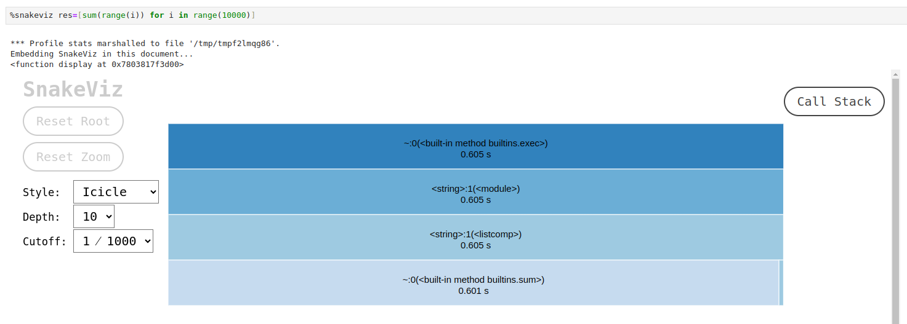
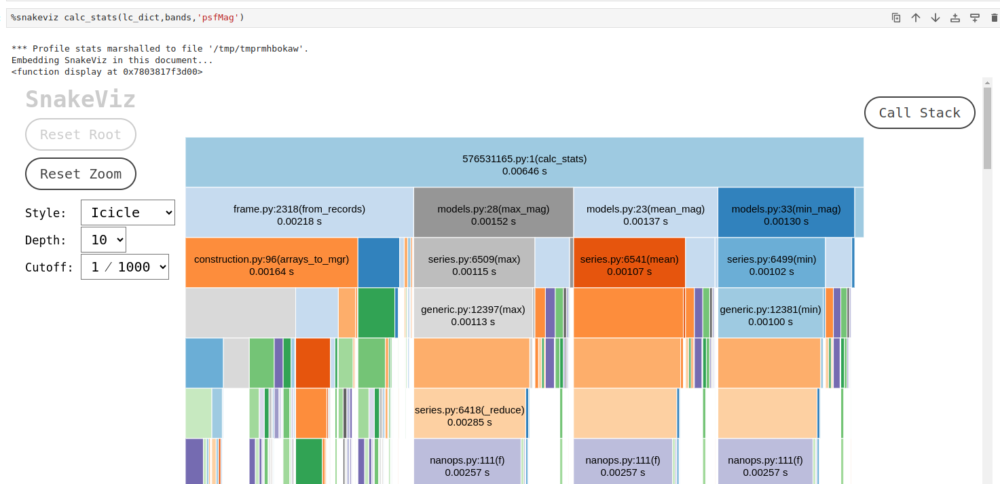
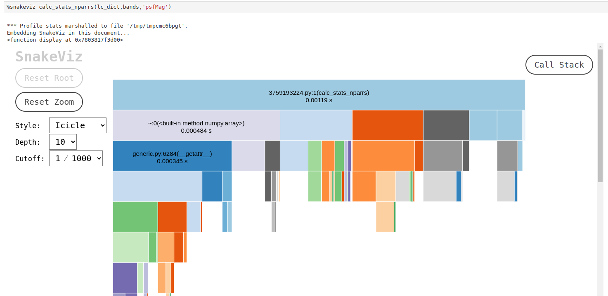

## What is Software Profiling?

We may have a software that is doing everything that we want it to do, with its codebase well-written 
and perfectly comprehensible, but this does not yet guarantee that this software will be applicable to the real-world problems.
For example, its interface can be so convoluted that the user can't figure out how to access the feature of interest. Other common
issue is when the software has such high [computational complexity](https://en.wikipedia.org/wiki/Computational_complexity) that it 
can be used only on small datasets, or on computer clusters with hundreds of GB of memory.

The process of estimating how much time the execution of the software will take and how much memory or other resources it will need
is called **profiling**. Profiling is a form of **dynamic program analysis**, meaning that it requires launching the software and measuring 
its performance and logging its activity as it runs. One of the main purposes of profiling is to identify *bottlenecks*,
inefficient operations, or high-latency components of the program, so that these parts could be optimized to run faster or
to use less resources. It is worth noting that for many problems there is a [space-time tradeoff](https://en.wikipedia.org/wiki/Space%E2%80%93time_tradeoff),
which essentially means that by optimizing the program in respect to the execution time we make it less memory-efficient, and vice versa.

How necessary profiling is for academic software development?
Well, it is ok to skip profiling when working on small projects that can be easily executed on your PC 
or within a Google Colab notebook. However, as your projects get larger, the execution of your code
may start taking days and weeks, or it may start crashing due to the lack of RAM or CPU power. Another
example when the efficiency is crucial is executing your code at astronomical data access portals,
such as [Rubin Science Platform](https://data.lsst.cloud/) or [Astro Data Lab](https://datalab.noirlab.edu/). 
These platforms provide an opportunity to work with large astronomical datasets without downloading them
to your machine, however, the CPU and memory allocated to each user are limited. Code profiling helps us 
to determine which implementation is more efficient and to make our code scalable. And if you are developing
software that will be used by someone else, it also makes the users happier (and in some cases
ensures that the software will be used at all).

In this introduction to profiling we mostly concentrate on time profiling, with some notes on memory profiling. 
We start with the Jupyter built-in tool, **Jupyter Magics**. 

## **What Are Jupyter Magics?**

Jupyter Magics are special commands in Jupyter Notebooks/Lab that extend functionality by providing shortcuts for tasks 
like timing, debugging, profiling, or interacting with the system, e.g. executing terminal commands from withing the notebook. They come in two forms:
- **Line Magics**: Prefixed with `%`, they operate on a single line of code.
- **Cell Magics**: Prefixed with `%%`, they apply to the entire cell.

> ## Why Magics aren't really part of the Jupyter
> 
> To be specific, Magic commands are part of the *Python kernels* that are used by the Jupyter Notebook or Lab.
> The *kernels* are separate processes, language-specific computational engines that are executing the commands you gave
> it with the code. The kernel with which your notebooks is launched is separate from the *frontend* processes that handle,
> for example, the tasks of adding or removing cells, or even rendering the characters when you type them during the execution of the
> previous cell. Think on how different it is from when you launch some commands in your PC terminal: there, you cannot
> type the next commands until the previous one finish executing. The separation of the Jupyter frontend from the kernel is what allows to
> avoid this behavior.
>
> By default, Jupyter uses [ipykernel](https://github.com/ipython/ipykernel), and Magic commands are a part of it. However,
> many different kernels for Jupyter exist, including some developed for other languages, such as R or Julia. Whether Magic commands are available for
> these kernels depends on their implementation.
> 
> If you want to know more how kernels work, [here](https://www.geeksforgeeks.org/managing-jupyter-kernels-a-comprehensive-guide/) is a generic overview with some
> practical examples.
> 
{: .callout}

There are plenty Magics cheatsheets online, however, the easiest way to look up what kinds of comands are there is to use Magics itself:
- `%lsmagic` - prints a list of all Magics available;
- `%quickref` - prints a reference card on the available Magic commands.

{: .image-with-shadow width="600px"}
{: .image-with-shadow width="600px"}

## Time Profiling with Magics

For time profiling, the most useful Magics are:

- **`%time`**: Measures execution time of a single line.
- **`%%time`**: Measures execution time of an entire cell.
- **`%timeit`**: Repeats timing of a line for reliable results.
- **`%%timeit`**: Repeats timing of a cell for average results.

Let's use this function to profile some code. As an example we'll use a code that calculates the first
thousand of partial sums of [series](https://en.wikipedia.org/wiki/Series_(mathematics)#Partial_sum_of_a_series) of natural numbers
and saves it into a list.

First, we need to create a new branch:
~~~
$ git checkout develop
$ git checkout -b profiling
~~~
{: .language-bash}

Then let's write one possible implementation of the code for the problem above:

~~~
%%time
# Example: Timing a block of code
result = []
for i in range(1000):
    result.append(sum(range(i)))
~~~
{: .language-python}

This code creates an empty list `result`, and then launches a `for` loop in which for each `i` in the range from 0 to 1000
a sum of all numbers from 0 to `i` is calculated and appended to the list. This code produces the following  output:

~~~
CPU times: user 10.4 ms, sys: 0 ns, total: 10.4 ms
Wall time: 10.2 ms
~~~
{: .output}

As you can notice, there are several measurements taken:

- **Wall Time**: Total elapsed time from start to end of a task, including waiting time for I/O operations or other processes.
- **CPU Time**: The time the CPU spends executing the code, further divided into **User Time** 
(time spent executing user code) and **System Time** (time spent on system-level operations, such as I/O or memory management).
- In general, there is also **Overhead**, which is the additional time introduced by profiling tools themselves, which may slightly skew results.

The double `%%` symbol means that `%%time` is applied to entire cell. Pay attention 
that if you use `%time` instead, the result will be very different:

~~~
CPU times: user 2 μs, sys: 0 ns, total: 2 μs
Wall time: 4.05 μs
~~~
{: .output}

2 *micro*seconds (since it's `μs` and not `ms`) instead of ten *milli*seconds. These microseconds is the measurement of an execution time of an *empty line*,
since `%time` command does not care about the code in the following lines.

If you launch the code above several times, you'll notice that the measured time can differ quite a lot. 
Depending on the specifics of the code and on the usage of system resources by other processes, 
the runtime of a code block may vary. As a side-remark, if you develop code running on a spacecraft, 
you want to avoid unpredictable runtime at all cost. To get a better measurement, 
`%timeit` and `%%timeit` runs the code seven times and produces mean and standard deviation of the execution time. This command
also discards outlying measurements that are likely caused by temporary system slowdowns (e.g. caused by other software that is running on your PC).

~~~
%%timeit
# Example: Timing a block of code with 'timeit'
result = []
for i in range(1000):
    result.append(sum(range(i)))
~~~
{: .language-python}

~~~
4.43 ms ± 35.2 μs per loop (mean ± std. dev. of 7 runs, 100 loops each)
~~~
{: .output}

The `7 runs, 100 loops each` tells us that the code was executed 7x100 times in total. While 7 runs is the set default value, the number of the loops
is calculated automatically depending on how fast your code is, so that profiling didn't take too much time. You can change the number of
runs and loops using the flags `-n` and `-r`, for example, like this: `%%timeit -n 4 -r 10` to run the code 4 times, with 10 loops in each run. 
Another useful flag is `-o` that allows you to store the result of the profiling in a variable:

~~~
%%timeit -n 4 -r 10 -o
# Example: Timing a block of code with saving the profiling result
result = []
for i in range(1000):
    result.append(sum(range(i)))
~~~
{: .language-python}

~~~
# In a new cell we save the content of the temporary
# variable '_' into a new variable 'measure'
measure = _
measure
~~~
{: .language-python}

~~~
<TimeitResult : 5.16 ms ± 1.56 ms per loop (mean ± std. dev. of 10 runs, 4 loops each)>
~~~
{: .output}

`measure` variable is a `TimeitResult` object that has some useful methods that allow us to see e.g. the value of the worst measurement
and the measurements of all runs.

## Memory Profiling with Magics

On machines with limited RAM, we could also consider profiling memory usage. For this we can install more magic commands, e.g. from [Python Package Index](https://pypi.org/)

~~~
$ python -m pip install ipython-memory-magics
~~~
{: .language-python}

and load the external memory magic via

~~~
%load_ext memory_magics
~~~
{: .language-python}

Now we can analyze the memory usage in our cell

~~~
%%memory
# Example: Memory usage
result = []
for i in range(1000):
    result.append(sum(range(i)))
~~~
{: .language-python}

The output of this should look as follows:

~~~
RAM usage: cell: 35.62 KiB / 35.79 KiB
~~~
{: .output}

This reports *current* and *peak* memory usage of the code. Another useful
option is to use `%memory -n` command in an empty cell, which will print how much RAM the whole current *notebook*
is taking.

~~~
RAM usage: notebook: 158.61 MiB
~~~
{: .output}

> ## Execution time with Magics
> 
> Use Magic commands to measure execution time for functions `max_mag` and `plot_unfolded`.
>
> > ## Solution
> >
> > Either in a new section of the `light-curve-analysis.ipynb` notebook
> > or in a new notebook we can import the `max_mag` function and use `%time` command:
> > 
> > ~~~
> > from lcanalyzer.models import max_mag
> > ...
> > %time lcmodels.max_mag(lc[lc_bands_masks[b]],mag_col=mag_col)
> > ~~~
> > {: .language-python}
> > 
> > ~~~
> > CPU times: user 1.94 ms, sys: 155 μs, total: 2.1 ms
> > Wall time: 1.9 ms
> > np.float64(18.418037351622612)
> > ~~~
> > {: .output}
> >
> > And we see that this command takes only a few microseconds to run.
> > Pay attention that in order for this command to work, it should be in the same line as the
> > code you are profiling. Otherwise, you need to use a *cell* Magic preceded by `%%`.
> >
> > Next use `%timeit` on a plotting function:
> > ~~~
> > %timeit views.plot_unfolded(lc[lc_bands_masks[b]],time_col=time_col,mag_col=mag_col,color=plot_filter_colors[b],marker=plot_filter_symbols[b])
> > ~~~
> > {: .language-python}
> >
> > ~~~
> > 347 ms ± 9.54 ms per loop (mean ± std. dev. of 7 runs, 1 loop each)
> > ~~~
> > {: .output}
> > 
> > Wow, what happened? We got seven copies of the same plot! This is because `%timeit` repeats the execution and measures the average time.
> > Plotting also takes noticeably longer time that a simple calculation of a maximum value.
> > 
> {: .solution}
>  
{: .challenge}

## A Few Words on Optimization

Let's take our 'partial sums of series' problem and think on how we can optimize it to run faster. 
You may remember that Python has [list comprehensions](https://docs.python.org/2/tutorial/datastructures.html#list-comprehensions)
syntax that is often recommended as a faster tool than `for` loops. We can rewrite the code above to use list comprehensions
and use `%%timeit` magic to profile it.

~~~
%%timeit
# Implementation with list comprehension
result = [sum(range(i)) for i in range(1000)]
~~~
{: .language-python}

~~~
4.43 ms ± 71 μs per loop (mean ± std. dev. of 7 runs, 100 loops each)
~~~
{: .output}

Well... Actually, we got pretty much the same result. For this particular case, there is no computational
gain in using list comprehension, although the code is cleaner and more readable this way. However, if we experiment
with the maximum value of the range, we'll start noticing the gain with the increase of this value. That said,
for some problems list comprehensions may work even slower than `for` loops, which is why time profiling
is something to do *before* you start optimization - it may turn out that the bottleneck is in a completely different
part of the program than you thought. In order to optimise this specific piece of code, we would have to be
smarter and use an equation instead of the bruteforce approach:

~~~
%%timeit
# Optimized implementation using mathematical formula for summation
result = [(i * (i - 1)) // 2 for i in range(1000)]
~~~
{: .language-python}

~~~
77.6 μs ± 812 ns per loop (mean ± std. dev. of 7 runs, 10,000 loops each)
~~~
{: .output}

Now the execution time is in dozens of *micro*seconds, which is two orders better than before! 
That's quite an improvement.

## **What If You Don’t Use Jupyter?**

Of course, Jupyter Magics isn't the only tool for time profiling. In fact, Python has built-in modules just for this, such as `time` and `timeit`, 
that can be used in any IDE. 

~~~
import time
...
start_time = time.time()
max_mag = lcmodels.max_mag(lc[lc_bands_masks[b]],mag_col=mag_col)
print(f"Execution time: {time.time() - start_time:.5f} seconds")
~~~
{: .language-python}

~~~
Execution time: 0.00083 seconds
~~~
{: .output}

In this snippet of code, `time.time()` function records the current time in seconds since the epoch (typically January 1, 1970).
 This value is stored in the variable `start_time` before the code block is executed. 
After the code block, `time.time()` is called again to get the current time.
The difference between the current time and `start_time` gives the total execution time.
This elapsed time is formatted to five decimal places and printed. The `time`
 library is useful also in notebooks, when we want to get a detailed execution time log from the inside
 of a larger piece of code, e.g. a function.
 
To get a more reliable estimate, for the small snippets of code we can use `timeit.repeat()` method. 
It executes the timing multiple times and provides a list of results, making it easier to analyze performance under changing environments.

~~~
import timeit
results = timeit.repeat('sum([i**2 for i in range(1000)])', repeat=5, number=1000)
print("Timing Results:", results)
print("Best Execution Time:", min(results))
~~~
{: .language-python}

~~~
Timing Results: [0.17868508584797382, 0.16405000817030668, 0.16924912948161364, 0.1637995233759284, 0.16636504232883453]
Best Execution Time: 0.1637995233759284
~~~
{: .output}

The `repeat` and `number` parameters of this function work similarly to the number of runs and number of loops for the `%%timeit`.
However, this method cannot be used conveniently for e.g. measuring execution time of functions. For this, we need a more advanced tool.

> ## Additional reading on 'time' module and 
> 
> Some additional sources to look into are:
>
> - [Python timeit Module](https://docs.python.org/3/library/timeit.html):  Detailed explanation of how to use the `timeit` module for benchmarking Python code.
> - [Python time Module](https://docs.python.org/3/library/time.html): Overview of the `time` module, including functions like `time()`, `sleep()`, and more.
> - [Profiling in Python](https://www.geeksforgeeks.org/profiling-in-python/): A beginner-friendly introduction to time profiling methods in Python.
>   
{: .callout}

## Resource profiling with offline profilers

Jupyter Magics, while extremely useful for small-scale profiling, aren't a suitable tool for larger projects. Prioritizing development requires to understand multiple
aspects of the code 'under-the-hoods':

- The frequency at which a function is called,
- The execution time for each function,
- The performance of different algorithms, 
- Benchmarking pure python vs external C code,
- Identify bottlenecks and gauge how involved a change is compared to the development effort.

There are numerous tools for these inquiries. Here we will consider the [`cProfile`](https://docs.python.org/3/library/profile.html#) and
[`snakeviz`](https://jiffyclub.github.io/snakeviz/#snakeviz) modules.

`cProfile` is a built-in Python module that measures how many times each function was called from within the code
that is being profiled and how much time the execution of each function took. `cProfile` is partially written in C, which makes it faster
and reduces the overhead that is inevitably added by any profiler. If `cProfile` doesn't work on your PC, you can try to use pure Python version
of this module called `profile`.

`cProfile` can be imported like any other package, and then used to profile any code by passing it in quotation marks to the function `run`:
~~~
import cProfile

profiler = cProfile.Profile()
profiler.run('[sum(range(i)) for i in range(10000)]')
profiler.print_stats(sort='cumulative')
~~~
{: .language-python}

~~~
         10004 function calls in 0.616 seconds

   Ordered by: cumulative time

   ncalls  tottime  percall  cumtime  percall filename:lineno(function)
        1    0.000    0.000    0.616    0.616 {built-in method builtins.exec}
        1    0.000    0.000    0.616    0.616 <string>:1(<module>)
        1    0.007    0.007    0.616    0.616 <string>:1(<listcomp>)
    10000    0.609    0.000    0.609    0.000 {built-in method builtins.sum}
        1    0.000    0.000    0.000    0.000 {method 'disable' of '_lsprof.Profiler' objects}
~~~
{: .output}

First we are initializing a `Profile()` instance, then we execute the profiling, and then printing the output sorted
by the cumulative time spent in each of the funtions. The columns in this statistical table report how many times
each functon was called (`ncalls`; we can see that in this example the only function with multiple calls in `sum`), how much time in
total was spent in each function (`tottime`; it does not take into account the time spent in sub-functions), average time per each call (`percall`),
how much time was spent in this function taking into account sub-functions (`cumtime`) and average time per call considering sub-calls (second `percall`).
We sorted this output by the `cumtime` column, however, if we change sorting to `tottime`, we'll see that most of the time was spent in the `sum` functions. 
Which is not surprising, considering that we made a 10000 calls of this function!

### Visualizing Profiling Output with SnakeViz

An output table of `cProfile` can be really large and confusing. It would be nice to have a visual representation of this data.
Fortunately, there is a tool for this, a module called `snakeviz`.

First let's install it and update the `requirements.txt` file:
~~~
$ python -m pip install snakeviz
$ pip freeze > requirements.txt
~~~
{: .language-bash}

In order to use it from within the notebook, we have to load it as an external magic:

~~~
%load_ext snakeviz
~~~
{: .language-python}

~~~
%snakeviz res=[sum(range(i)) for i in range(10000)]
~~~
{: .language-python}

{: .image-with-shadow}

Now we have a nice interactive representation of the time spent in each function, and it is obvious that the summation itself takes the longest. 
We can choose between two formats of the visualization using 'Style' drop-down menu, set the maximum depth of the call stack that is being visualized and 
set the cutoff value for the functions that won't be placed on the plot (e.g. by default the functions that take less than 1/1000 of the execution time
of the parent function are omitted). By clicking on any of the bars we go deeper into the callstack. 
Under the plot we have the same statistical table as the `cProfile` produces.  There is also a way to open this visualization in a new browser tab by
passing the flag `-t` after the command.

> ## Other Visualization Tools for cProfile
>
> `SnakeViz` isn't the only visualization tool for profiling. You may want to look at the [gprof2dot](https://pypi.org/project/gprof2dot/)
> which plots call graphs in the following way, which some users could find more intuitive than the default `snakeviz` plots:
> 
> {: .image-with-shadow}
> 
{: .callout}

> ## Use SnakeViz to profile the lcanalyzer.calc_stats() function and optimize it for a quicker execution
>
> Apply the `%snakeviz` to the lcanalyzer.calc_stats() function. Have a look at the output, identify which functions are taking the longest
> to execute and optimize this code to execute faster.
>
> > ## Solution
> >
> > After running the following code: `%snakeviz calc_stats(lc_dict,bands,'psfMag')`, we obtain a visualization that looks similar to this:
> > {: .image-with-shadow}
> > We can notice that a lot of time is spent in the `__getitem__` `pandas` core function, that is invoked when we use indexing to retrieve some element
> > from a DataFrame. The `pandas` statistical functions take approximately the same amount of time.
> >
> > One thing that can be done right away is reducing the number of indexing calls and switching to the `numpy` statistical functions by converting our data into
> > a `numpy.array`, e.g. like this:
> >
> > ~~~
> > def calc_stats_nparrs(lc, bands, mag_col):
> >     # Calculate max, mean and min values for all bands of a light curve
> >     stats = {}
> >     for b in bands:
> >         arr = np.array(lc[b][mag_col])
> >         stat = {'max':np.max(arr),'mean':np.mean(arr),'min':np.min(arr)}
> >         stats[b] = stat
> >     return stats
> > ~~~
> > {: .language-python}
> >
> > The profiling result for this function will look like this:
> > 
> > {: .image-with-shadow}
> >
> > The new version of the function works almost 6 times faster, however, for this we had to change the format of the output.
> > Meaning, we have to rewrite the higher levels of the code and our tests, and, perhaps, rethink in general the data architecture of our
> > software.
> > 
> {: .solution}
> 
{: .challenge}

> ## Resource profiling with online profilers
>
> Profiling a running project can be an invaluable tool for identifying and addressing issues, 
> as it catches unusual events that may not be obvious during development. 
> It is possible to do a real-time performance monitoring, although the detailed info on the corresponding instruments
> goes beyond the scope of today's workshop. As starting points for further reading, you can have a look at these two 
> repositories:
> 
> 1. [py-spy](https://github.com/benfred/py-spy)
> 2. [pyinstrument](https://github.com/joerick/pyinstrument)
> 
{: .callout}


