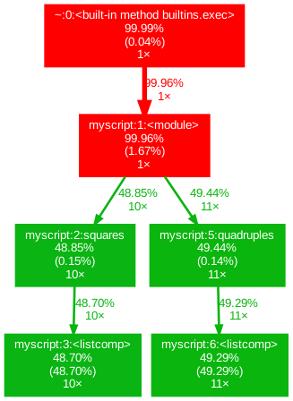

## Jupyter Magics

- What is magics
- Which kinds of magics exist
- How to use them for time profiling
- What if you don't use Jupyter?

---

## What is Software Profiling?

Profiling is...

Time profiling is the process of measuring the time taken by a program, 
a specific block of code, or individual functions to execute. It helps 
developers analyze the performance of their software by identifying bottlenecks, 
inefficient operations, or high-latency components. Time profiling provides insights 
into how the program uses computational resources (CPU, memory, I/O), enabling performance optimization.

It is ok to skip profiling when working on small projects that can be easily executed on your PC 
or within a Google Colab notebook. However, as your projects get larger, the execution of your code
may start taking days and weeks, or it may start crashing due to the lack of RAM or CPU power. Another
example when the efficiency is crucial is executing your code at the astronomical Data Acess portals,
such as [Rubin Science Platform](https://data.lsst.cloud/) or [Astro Data Lab](https://datalab.noirlab.edu/). 
These platforms provide an opportunity to work with large astronomical datasets without downloading them
on your machine, however, the CPU and memory allocated to each user are limited. Code profiling helps us to find bottlenecks
in our code, to determine which implementation is more efficient and to make our code scalable. And if you are developing
software that will be used by someone else, it also helps you to make your users happier (and in some cases
ensures that the software will be used at all).

## **What Are Jupyter Magics?**

Jupyter Magics are special commands in Jupyter Notebooks that extend functionality by providing shortcuts for tasks 
like timing, debugging, profiling, or interacting with the system, e.g. executing terminal commands from withing the notebook. They come in two forms:
- **Line Magics**: Prefixed with `%`, they operate on a single line of code.
- **Cell Magics**: Prefixed with `%%`, they apply to the entire cell.

There are plenty Magics cheatsheets online, however, the easiest way to look up what kinds of comands are there is to use Magics itself:
- `%lsmagic` - prints a list of all Magics available;
- `%quickref` - prints a reference card on the available Magic commands.

{: .image-with-shadow width="600px"}
{: .image-with-shadow width="600px"}

For time profiling, the most useful Magics are:

- **`%time`**: Measures execution time of a single line.
- **`%%time`**: Measures execution time of an entire cell.
- **`%timeit`**: Repeats timing of a line for reliable results.
- **`%%timeit`**: Repeats timing of a cell for average results.

Let's try to profile execution time for some functions of our `lcanalyzer` module. 

> ## Execution time with Magics
> Create a new branch called `profiling`
> and execute the Magic commands above to measure execution time for functions `max_mag` and `plot_unfolded`.
>
> > ## Solution
> >
> > First, we need to create a new branch:
> > ~~~
> > $ git checkout develop
> > $ git checkout -b profiling
> > ~~~
> > {: .language-bash}
> >
> > Next, in the `light-curve-analysis.ipynb` we can import the `max_mag` function and use `%time` command:
> > from lcanalyzer.models import max_mag
> >
> > ~~~
> > from lcanalyzer.models import max_mag
> > ...
> > %time lcmodels.max_mag(LC[bands[b]],mag_col=mag_col)
> > ~~~
> > {: .language-python}
> > 
> > ~~~
> > CPU times: user 1.94 ms, sys: 155 μs, total: 2.1 ms
> > Wall time: 1.9 ms
> > np.float64(18.418037351622612)
> > ~~~
> > {: .output}
> >
> > And we see that this command takes only a few microseconds to run.
> > Pay attention that in order for this command to work, it should be in the same line as the
> > code you are profiling. Otherwise, you need to use a *cell* Magic preceded by double `%`.
> >
> > Next use `%timeit` on a plotting function:
> > ~~~
> > %timeit views.plot_unfolded(LC[bands[b]],time_col=time_col,mag_col=mag_col,color=plot_filter_colors[b],marker=plot_filter_symbols[b])
> > ~~~
> > {: .language-python}
> >
> > ~~~
> > 347 ms ± 9.54 ms per loop (mean ± std. dev. of 7 runs, 1 loop each)
> > ~~~
> > {: .output}
> > Wow, what happened? We got seven copies of the same plot! This is because `%timeit` repeats the execution and measures the average time.
> > Plotting also takes noticeably longer time that a simple calculation of a maximum value.
> {: .solution}
>
{: .challenge}

As you can notice, the output of these Magic commands contains several different time values:

- **Wall Time**: Total elapsed time from start to end of a task, including waiting time for I/O operations or other processes.
- **CPU Time**: The time the CPU spends executing the code, further divided into **User Time** 
(time spent executing user code) and **System Time** (time spent on system-level operations, such as I/O or memory management).
- In general, there is also **Overhead**, which is the additional time introduced by profiling tools themselves, which may slightly skew results.

`timeit` Magics also report standard deviation of the execution time, calculated from the best run from a set of iterations,
so that outliers from temporary system slowdowns (e.g. caused by other software that is running on your PC) are not included.

## **What If You Don’t Use Jupyter?**

Of course, Jupyter Magics isn't the only tool for time profiling. In fact, Python has built-in modules just for this, such as `time` and `timeit`, 
that can be used in any IDE. 
~~~
import time
...
start_time = time.time()
max_mag = lcmodels.max_mag(LC[bands[b]],mag_col=mag_col)
print(f"Execution time: {time.time() - start_time:.5f} seconds")
~~~
{: .language-python}

~~~
Execution time: 0.00083 seconds
~~~
{: .output}

  - The `time.time()` function records the current time in seconds since the epoch (typically January 1, 1970).
  - This value is stored in the variable `start_time` before the code block is executed.
  - After the code block, `time.time()` is called again to get the current time.
  - The difference between the current time and `start_time` gives the total execution time.
  - This elapsed time is formatted to five decimal places and printed.

To get a more reliable estimate, for the small snippets of code we can use `timeit.repeat()` method. 
It executes the timing multiple times and provides a list of results, making it easier to analyze performance under changing environments.

~~~
import timeit
results = timeit.repeat('sum([i**2 for i in range(1000)])', repeat=5, number=1000)
print("Timing Results:", results)
print("Best Execution Time:", min(results))
~~~
{: .language-python}

~~~
Timing Results: [0.17868508584797382, 0.16405000817030668, 0.16924912948161364, 0.1637995233759284, 0.16636504232883453]
Best Execution Time: 0.1637995233759284
~~~
{: .output}

The parameters of this function:
- `repeat=5`: Runs the benchmark 5 times, producing a list of 5 results. Each result corresponds to the total execution time for the specified number of iterations.
- `number=1000`: Executes the code snippet 1000 times per benchmark run.

The output:
- **List of Results**: Each value in the `results` list represents the total time for 1000 executions of the code snippet.
- **Best Execution Time**: Use `min(results)` to find the fastest execution time across the 5 runs. This is often the most reliable measure of the code's performance as it minimizes the impact of temporary system noise or background processes.

However, this method cannot be used conveniently for e.g. measuring execution time of functions. For this, we need a more advanced tool.

## **References on Time Profiling**

**1. Official Documentation**
- [Python timeit Module](https://docs.python.org/3/library/timeit.html)  
  Detailed explanation of how to use the `timeit` module for benchmarking Python code.
- [Python time Module](https://docs.python.org/3/library/time.html)  
  Overview of the `time` module, including functions like `time()`, `sleep()`, and more.

**2. Jupyter Notebook Magics**
- [IPython Magic Commands Documentation](https://ipython.readthedocs.io/en/stable/interactive/magics.html)  
  Comprehensive list of magic commands available in Jupyter and IPython, including `%time`, `%timeit`, and others.
- **GeeksforGeeks: Time Profiling in Python**  
  [Link](https://www.geeksforgeeks.org/profiling-in-python/)  
  A beginner-friendly introduction to time profiling methods in Python.

## IPython Magics for casual profiling

Before discussing the most important tools for profiling, we are briefly introducing a more 
pedestrian approach to assess the runtime of a single code block. For this purpose we are going 
to use IPython Magics, which are part of the respective IPython kernel or specified by users. 
Either way, the command needs to be prefixed with at least one `%` symbol and can run various operations. 
A simple example is to list the files in the current working directory:

~~~
%ls
~~~
{: .language-python}

On most operating systems you can execute the following function to analyze the runtime:

~~~
$ time python myscript.py
~~~
{: .language-python}

If we are using a juypyter notebook with an IPython kernel, the following the `%time` magic can be used which is used for timing code blocks. 

~~~
%time [x**2 for x in range(7777777)]
~~~
{: .language-python}

It reports the so-called wall clock time, i.e. the elapsed actual time, but also the user CPU time. The single `%` symbol means that `%time` is applied to single cell. To apply magic commands to an entire cell, we use `%%`:

~~~
%%time 
squares = [x**2 for x in range(7777777)]
quadrupels = [x**4 for x in range(7777777)]
~~~
{: .language-python}

Depending on the structure of the datasets in question or if stochastic processes are involved, the runtime of a code block may vary. As a side-remark, if you develop code running on a spacecraft, you want to avoid unpredictable runtime at all cost. To get a better measurement, `%%timeit` comes with extra options to test a block multiple times, which also allows us to get a mean and standard deviation:

~~~
%%timeit
squares = [x**2 for x in range(7)]
quadrupels = [x**4 for x in range(7)]
~~~
{: .language-python}

The output of this reveals that after 7 runs with 100,000 the following measurement is available:

~~~
4.51 μs ± 16 ns per loop (mean ± std. dev. of 7 runs, 100,000 loops each)
~~~
{: .language-python}

The pedestrian approach of using `%timeit` works for blocks of code but testing multiple functions, the number of calls and time it takes can be helpful. The goal is usually to identify the slowest function, but the difference between wall time and user CPU time can reveal that file operations with local or remote drives may be a limiting factor. On machines with limited RAM, we could also consider profiling memory usage. For this we can install more magic commands, e.g. from [Python Package Index](https://pypi.org/)

~~~
$ python -m pip install ipython-memory-magics
~~~
{: .language-python}

and load the external memory magic via

~~~
%load_ext memory_magics
~~~
{: .language-python}

Now we can analyze the memory usage in our cell

~~~
%%memory
squares = [x**2 for x in range(7777)]
quadruples = [x**4 for x in range(7777)]
~~~
{: .language-python}

The output of this should look as follows:

~~~
RAM usage: cell: 590.7 KiB / 590.94 KiB
~~~
{: .language-python}

## Resource profiling with offline profilers

Profiling is the essential technique for identifying bottlenecks and optimize performance in larger projects. This process can significantly impact both the success of a project and its environmental footprint, as high-performance code may consume more resources and energy. Finding a balance between the time it takes to develop code and the cost of running the code itself motivates us to analyze projects in a more detailed fashion. Relying on the pedestrian approach in the last section can be useful for benchmarking smaller blocks of code, but it is not a sustainable approach for larger projects. Prioritizing development requires to understand

* The frequency at which a function is called
* The execution time for each function
* The performance of different algorithms 
* Benchmarking pure python vs external C code
* Identify bottlenecks and gauge how involved a change is compared to the development effort

As a rule of thumb, software developers tend to profile work on improving 10 to 20% of their codebase. To accomplish this we can use `cProfile` to prepare the performance statistics and utilize `snakeviz` to visualize the statistics in a more user friendly way. To install `snakeviz` run

~~~
$ python -m pip install snakeviz
~~~
{: .language-bash}

You can generate performance statistics for a script `myscript.py` using `cProfile` with the following command:

~~~
$ python -m cProfile -o output.stats myscript.py
~~~
{: .language-bash}

An interactive view of these statistics can be obtained by running:

~~~
$ snakeviz output.stats
~~~
{: .language-bash}

This will open in your browser, showing an interactive table that is particularly useful for inspecting the number of function calls and elapsed time per function call (among other metrics). We are using our `squares` and `quadruples` functions to illustrate how the output looks like. The table can be sorted by any column. Performance statistics show not only your functions, but also functions from the standard library, e.g. list comprehensions are shown separately. 

{: .image-with-shadow}

Two visualization options are available: an icicle view, which displays the function calls as cumulative timings icicles with corresponding line numbers, and a sunburst diagram, both of which allow you to explore the call hierarchy.

{: .image-with-shadow }

The sunburst diagram looks as follows:

{: .image-with-shadow}

 
 If you prefer to run the profiler directly within a Jupyter Notebook, you need to load the external snakeviz magic:

~~~
%load_ext snakeviz
~~~
{: .language-python}

and test it using our example

~~~
def squares(n):
    squares = [x**2 for x in range(n)]

%snakeviz squares(777)
~~~
{: .language-python}

Based on the output, we would mention a tool providing call graphs in passing: [gprof2dot](https://pypi.org/project/gprof2dot/) can be used to plot call graphs in the following way, which some users could find more intuitive than the default `snakeviz` plots:

 {: .image-with-shadow}
 
We would like to conclude this session by illustrating how you can integrate and run the `cProfile` profiler into your main code, and we are testing two calls of our function squares

~~~
from cProfile import Profile
profiler = Profile()

profiler.run('squares(777777); squares(777777)')
profiler.disable()
profiler.print_stats(sort='cumulative')
~~~
{: .language-python}

this should return a list as follows which can also be written to disk using `profiler.dump_stats(filename)`:

~~~
 7 function calls in 0.522 seconds

   Ordered by: cumulative time

   ncalls  tottime  percall  cumtime  percall filename:lineno(function)
        1    0.000    0.000    0.522    0.522 {built-in method builtins.exec}
        1    0.011    0.011    0.522    0.522 <string>:1(<module>)
        2    0.000    0.000    0.511    0.256 890459632.py:5(squares)
        2    0.511    0.256    0.511    0.256 890459632.py:6(<listcomp>)
        1    0.000    0.000    0.000    0.000 {method 'disable' of '_lsprof.Profiler' objects}
~~~
{: .output}

> ## Optional Exercise: Profile lightcurve
>
> Try to profile the methods devised for lightcurve analysis. 
>
> > ## Solution
> > tbd
> {: .solution}
> 
{: .challenge}

## Resource profiling with online profilers

Profiling a running project can be an invaluable tool for identifying and addressing issues, as it catches unusual events that may not be obvious during development. While this course focuses on offline profiling techniques using tools like `cProfile` and `snakeviz`, we would like to mention that monitoring performance in real-time can be crucial for certain projects. In this context, we would like to highlight two repositories as starting points for further reading:

1. [py-spy](https://github.com/benfred/py-spy)
2. [pyinstrument](https://github.com/joerick/pyinstrument)


